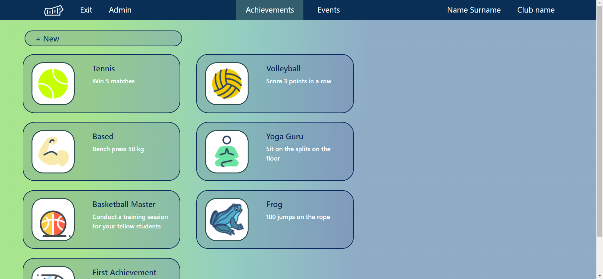
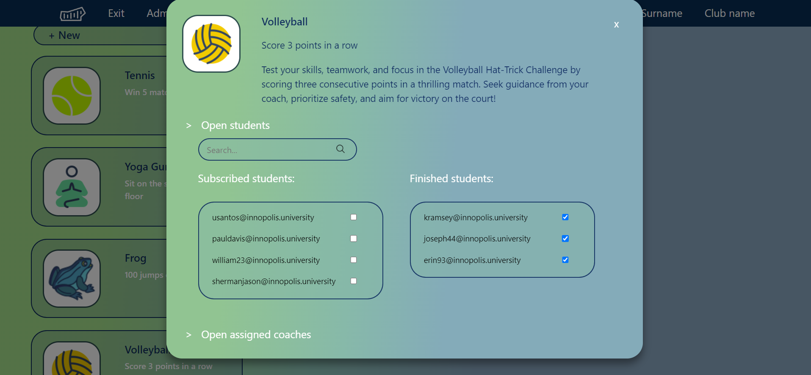
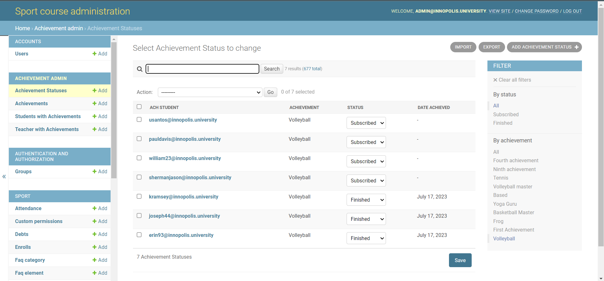

# [SWP] Sport Achievements: functionality for coaches

 

## Table of Contents
- [Project description](#project-description)
- [Demo](#demo)
- [How to use](#how-to-use)
- [Features list](#features-list)
- [Project Installation](#project-installation)

## Project description
The main idea of Sport Achievements project is to add achievements to Innopolis University Sport website.

This part of the project is directed to coaches functionality specifically. Coaches should be able to mark achievements as completed, when a student shows them their progress.

The project is licensed under MIT License (X11 license). See LICENSE file for more details.

## Demo
### Main Achievement website page

### Achievement card

### Admin panel

## How to use
The project was developed as a separate Django application (ach_admin) within the adminpage part in the Innopolis Sport website project. The developed application is configured to be launched integrated in Innopolis Sport website.

For development installation follow the steps described in the Project Installatoin section.

The whole project was deployed separately from current production version of Sport website.
Test deployed project [here](http://89.223.121.66/admin/login/?next=/admin/).

user: t.testovich@innopolis.university

password: pqowieur

Note: this user does not have all the admin functionality

## Features list
1. From admin page:
    * All the functionality from current Sport site admin page
    * Create new achievements
    * Change achievements
    * Select which students can have achievements
    * Select which coaches are responsible for achievements
    * Assign achievements to coaches
    * Assign achievements to students
    * Mark achievements as finished for students
    * Delete achievements
2. From coach page
    * See all achievements available for this coach
    * See achievement cards
    * Mark achievements as finished for particular students or return a student to a subscribed status.

## Project Installation
This part was taken from the original Sport website repository

### Requirements:
* Python3
* Docker

### How to start coding:
1. Clone the repository
2. Go to repo folder
3. `pip3 install -r ./adminpage/requirements.txt`. If not everything works at this stage (for example, some packages do not install), you still can move to the next step.
4. To start server
    1. Rename file: `example.env` to `.env`. If you do not have .env file, install it direactly from master branch.
    2. From repo folder: `docker-compose -f ./compose/docker-compose.yml up`. Docker on your computer should be opened beforehand.
5. To create superuser and make migrations
    1. `docker exec -it sport_adminpanel bash`
    2. `python manage.py makemigrations`
    3. `python manage.py migrate`
    4. `python manage.py createsuperuser`

##  Technologies used
* Python, Django framework
* HTML, CSS, JavaScript
* PostgreSQL
* Docker
